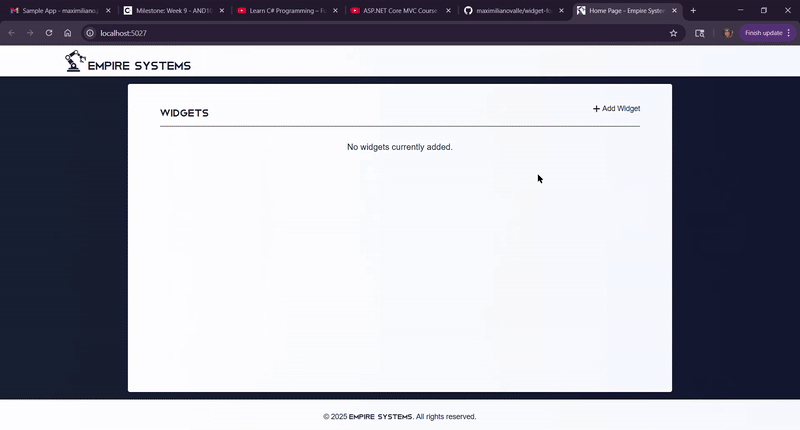

# Widget Form

## About The Project



<sup>Note: dropdown menus not captured by screenrecorder :(</sup>

Sample ASP.NET web app in C#!

### Prerequisites

* Visual Studio
* 'ASP.NET and web development' workload
* (Optional) Git Bash

### Installation

1. Clone the repository into your local machine

```sh
git clone git@github.com:maximilianovalle/widget-form.git
```

2. Navigate to the project directory and run the code
```sh
cd project-directory
dotnet watch run
```

## Acknowledgments

* [ASP.NET Core MVC Course for Beginners (.NET 9)](https://www.youtube.com/watch?v=RWXKysImabs)
